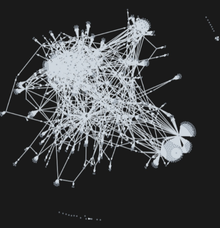
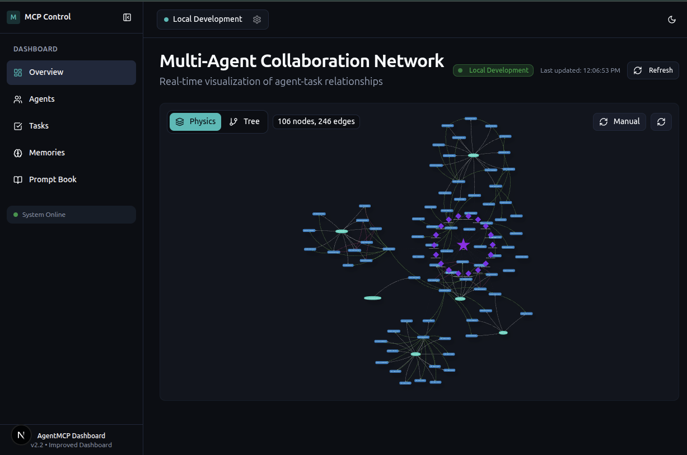
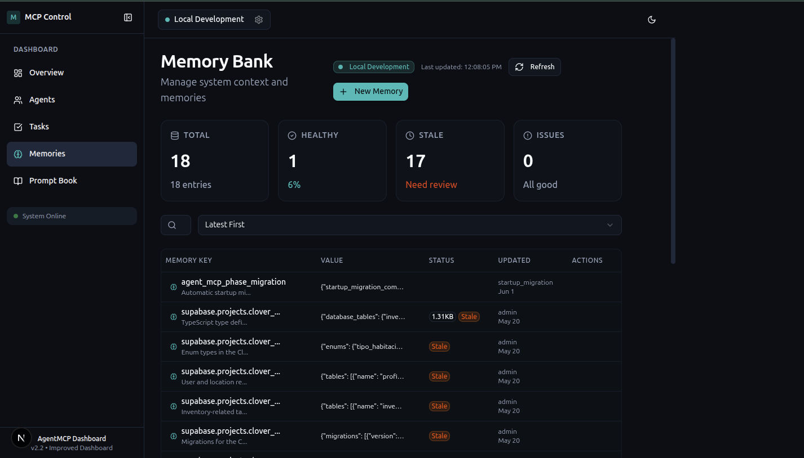
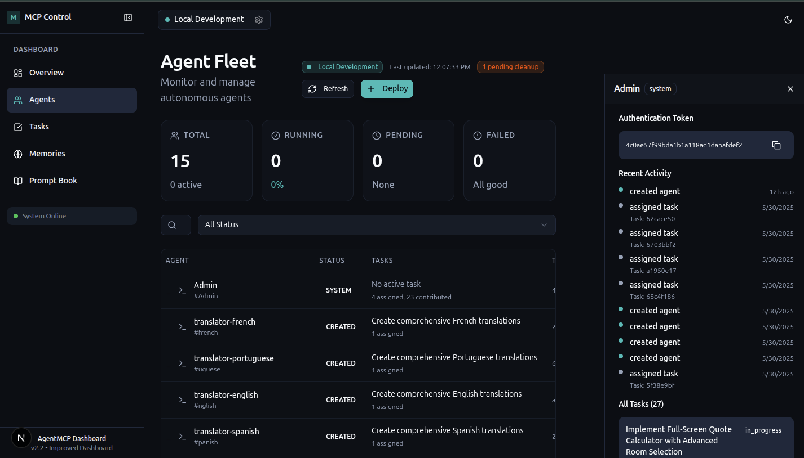

# Agent-MCP

[](https://deepwiki.com/rinadelph/Agent-MCP)

Multi-Agent Collaboration Protocol for coordinated AI software development.



Think **Obsidian for your AI agents** - a living knowledge graph where multiple AI agents collaborate through shared context, intelligent task management, and real-time visualization. Watch your codebase evolve as specialized agents work in parallel, never losing context or stepping on each other's work.

## The Problem with Single-Agent Development

Traditional AI coding assistants hit fundamental limitations:
- **Context windows overflow** on large codebases
- **Knowledge gets lost** between conversations
- **Single-threaded execution** creates bottlenecks
- **No specialization** - one agent tries to do everything
- **Constant rework** from lost context and confusion

## The Multi-Agent Solution

Agent-MCP transforms AI development from a single assistant to a coordinated team:



**Real-time visualization** shows your AI team at work - purple nodes represent context entries, blue nodes are agents, and connections show active collaborations. It's like having a mission control center for your development team.

### Core Capabilities

**Parallel Execution**  
Multiple specialized agents work simultaneously on different parts of your codebase. Backend agents handle APIs while frontend agents build UI components, all coordinated through shared memory.

**Persistent Knowledge Graph**  


Your project's entire context lives in a searchable, persistent memory bank. Agents query this shared knowledge to understand requirements, architectural decisions, and implementation details. Nothing gets lost between sessions.

**Intelligent Task Management**  


Monitor every agent's status, assigned tasks, and recent activity. The system automatically manages task dependencies, prevents conflicts, and ensures work flows smoothly from planning to implementation.

## Quick Start

```bash
# Clone and setup
git clone https://github.com/rinadelph/Agent-MCP.git
cd Agent-MCP
cp .env.example .env  # Add your OpenAI API key
uv venv && uv pip install -e .

# Start the server
uv run -m agent_mcp.cli --project-dir /path/to/your/project

# Launch dashboard (recommended for full experience)
cd agent_mcp/dashboard && npm install && npm run dev
```

## The 5-Step Workflow

### 1. Initialize Admin Agent
```
You are the admin agent.
Admin Token: "your_admin_token_from_server"

Your role is to:
- Coordinate all development work
- Create and manage worker agents
- Maintain project context
- Assign tasks based on agent specializations
```

### 2. Load Your Project Blueprint (MCD)
```
Add this MCD (Main Context Document) to project context:

[paste your MCD here - see docs/mcd-guide.md for structure]

Store every detail in the knowledge graph. This becomes the single source of truth for all agents.
```

The MCD (Main Context Document) is your project's comprehensive blueprint - think of it as writing the book of your application before building it. It includes:
- Technical architecture and design decisions
- Database schemas and API specifications
- UI component hierarchies and workflows
- Task breakdowns with clear dependencies

See our [MCD Guide](./docs/mcd-guide.md) for detailed examples and templates.

### 3. Deploy Your Agent Team
```
Create specialized agents for parallel development:

- backend-worker: API endpoints, database operations, business logic
- frontend-worker: UI components, state management, user interactions
- integration-worker: API connections, data flow, system integration
- test-worker: Unit tests, integration tests, validation
- devops-worker: Deployment, CI/CD, infrastructure
```

Each agent specializes in their domain, leading to higher quality implementations and faster development.

### 4. Initialize and Deploy Workers
```
# In new window for each worker:
You are [worker-name] agent.
Your Admin Token: "worker_token_from_admin"

Query the project knowledge graph to understand:
1. Overall system architecture
2. Your specific responsibilities
3. Integration points with other components
4. Coding standards and patterns to follow
5. Current implementation status

Begin implementation following the established patterns.

AUTO --worker --memory
```

### 5. Monitor and Coordinate

The dashboard provides real-time visibility into your AI development team:

**Network Visualization** - Watch agents collaborate and share information  
**Task Progress** - Track completion across all parallel work streams  
**Memory Health** - Ensure context remains fresh and accessible  
**Activity Timeline** - See exactly what each agent is doing

Access at `http://localhost:3847` after launching the dashboard.

## Advanced Features

### Specialized Agent Modes

**Standard Worker Mode**
```
AUTO --worker --memory
```
Full access to project memory and standard development tools.

**Frontend Specialist Mode**
```
AUTO --worker --playwright
```
Includes browser automation for component testing and visual validation.

**Research Mode**
```
AUTO --memory
```
Read-only access for analysis, documentation, and planning tasks.

### Project Memory Management

The system maintains several types of memory:

**Project Context** - Architectural decisions, design patterns, conventions  
**Task Memory** - Current status, blockers, implementation notes  
**Agent Memory** - Individual agent learnings and specializations  
**Integration Points** - How different components connect

All memory is:
- Searchable via semantic queries
- Version controlled for rollback
- Tagged for easy categorization
- Automatically garbage collected when stale

### Conflict Resolution

File-level locking prevents agents from overwriting each other's work:

1. Agent requests file access
2. System checks if file is locked
3. If locked, agent works on other tasks or waits
4. After completion, lock is released
5. Other agents can now modify the file

This happens automatically - no manual coordination needed.

## Real-World Results

Teams using Agent-MCP report:
- **70% faster development** on complex features
- **90% reduction** in context-related errors
- **Parallel execution** of previously sequential tasks
- **Zero conflicts** between agent implementations
- **Complete audit trail** of all development decisions

## Why Developers Choose Agent-MCP

**For Solo Developers**  
Transform your single AI assistant into a full development team. Work on frontend and backend simultaneously while maintaining perfect coordination.

**For Small Teams**  
Augment your team with specialized AI agents that never forget project context. Perfect for startups moving fast without sacrificing quality.

**For Complex Projects**  
Handle intricate codebases with multiple moving parts. The knowledge graph ensures every agent understands the full system architecture.

**For Learning**  
See exactly how professional development works by watching agents collaborate. Every decision is logged and can be traced.

## System Requirements

- Python 3.8+ with pip or uv
- Node.js 18+ with npm (for dashboard)
- OpenAI API key (for embeddings)
- 4GB RAM minimum
- AI coding assistant (Claude Code or Cursor)

## Troubleshooting

**"Admin token not found"**  
Check the server startup logs - token is displayed when MCP server starts.

**"Worker can't access tasks"**  
Ensure you're using the worker token (not admin token) when initializing workers.

**"Agents overwriting each other"**  
Verify all workers are initialized with the `--worker` flag for proper coordination.

**"Dashboard connection failed"**  
1. Ensure MCP server is running first
2. Check Node.js version (18+ required)
3. Reinstall dashboard dependencies

**"Memory queries returning stale data"**  
Run memory garbage collection through the dashboard or restart with `--refresh-memory`.

## Documentation

- [Getting Started Guide](./docs/getting-started.md) - Complete walkthrough with examples
- [MCD Creation Guide](./docs/mcd-guide.md) - Write effective project blueprints
- [Theoretical Foundation](./docs/chapter-1-cognitive-empathy.md) - Understanding AI cognition
- [Architecture Overview](./docs/architecture.md) - System design and components
- [API Reference](./docs/api-reference.md) - Complete technical documentation

## Community and Support

**Get Help**
- [Discord Community](https://discord.gg/7Jm7nrhjGn) - Active developer discussions
- [GitHub Issues](https://github.com/rinadelph/Agent-MCP/issues) - Bug reports and features
- [Discussions](https://github.com/rinadelph/Agent-MCP/discussions) - Share your experiences

**Contributing**
We welcome contributions! See our [Contributing Guide](CONTRIBUTING.md) for:
- Code style and standards
- Testing requirements
- Pull request process
- Development setup

## License

MIT License - see [LICENSE](LICENSE) for details.

---

Built by developers who believe AI collaboration should be as sophisticated as human collaboration.